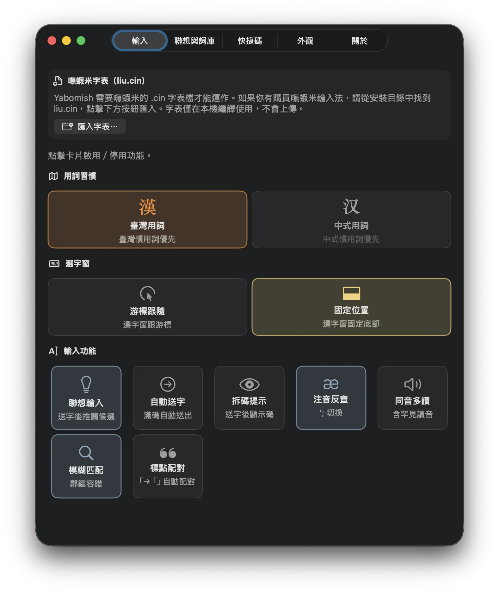
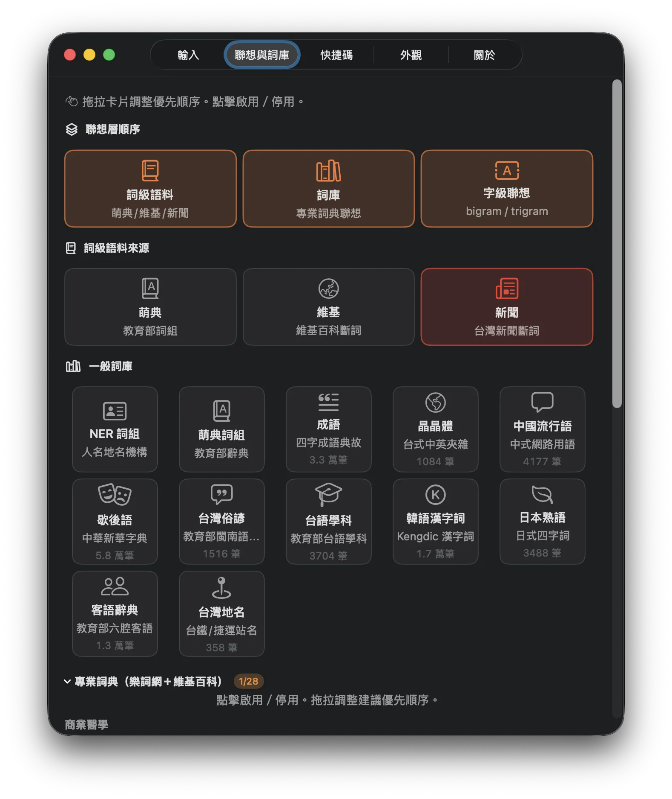
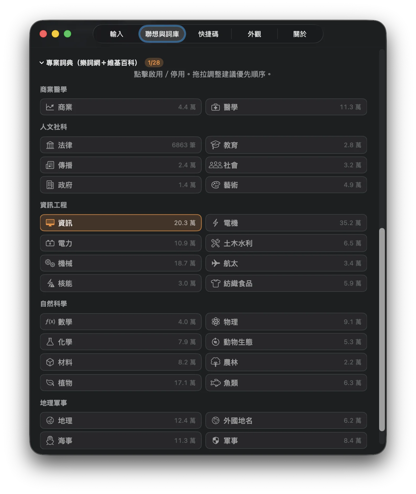
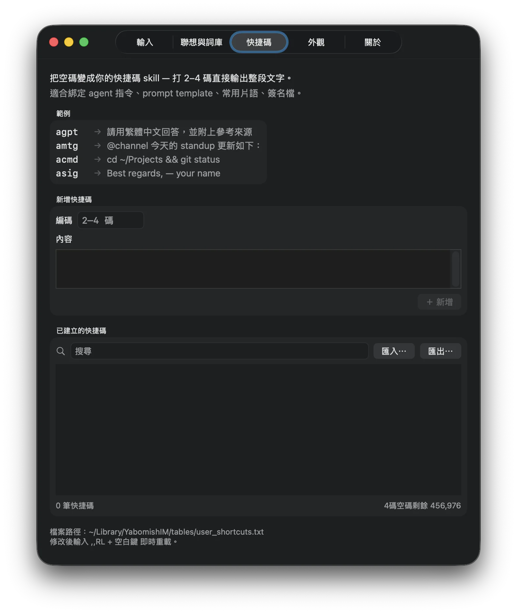
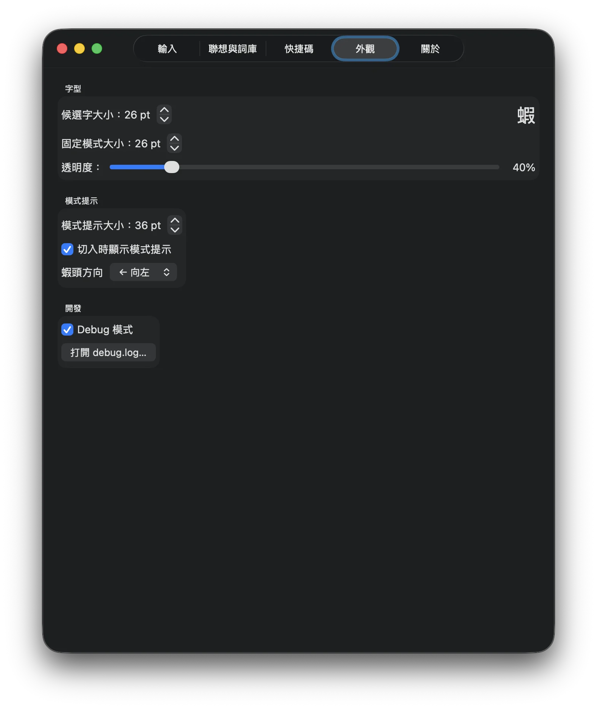
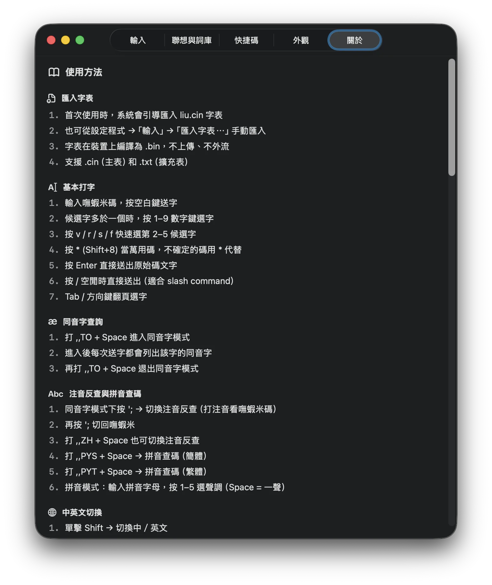

# Yabomish

macOS 嘸蝦米輸入法 — 純 Swift、零依賴、離線聯想。

## 特色

### 核心引擎
- **硬體 keyCode 對應** — Dvorak、Colemak、AZERTY 等非 QWERTY 鍵盤正常運作
- **CIN 字表裝置端編譯** — `.cin` 匯入後在裝置上編譯為 `.bin` 二進位格式（mmap zero-copy 載入）
- **安全輸入偵測** — 密碼欄位自動停用
- **模糊匹配** — 鄰鍵容錯，打錯一碼也能找到候選字

### 選字窗
- **游標跟隨模式** — 毛玻璃垂直列表，跟隨輸入游標
- **固定位置模式** — 水平列，可拖曳、右鍵調整對齊/透明度
- **多螢幕支援** — 自動偵測所在螢幕，GPU 終端無效座標時 fallback 固定模式
- **全螢幕 App 相容** — cmux/Ghostty 中正常顯示
- **VoiceOver 無障礙** — 候選字窗支援螢幕朗讀

### 輸入模式（`,,` 命令系統）

輸入 `,,` + 命令碼 + 空白鍵觸發：

| 命令 | 模式 |
|------|------|
| `,,T` | 繁中（預設） |
| `,,S` | 簡中 |
| `,,SP` | 速打（僅最短碼） |
| `,,SL` | 慢打（僅最長碼） |
| `,,TS` | 繁→簡轉換 |
| `,,ST` | 簡→繁轉換 |
| `,,J` | 日文假名 |
| `,,ZH` | 注音查碼 |
| `,,PYS` | 拼音查碼（簡體） |
| `,,PYT` | 拼音查碼（繁體） |
| `,,TO` | 同音字查詢模式 |
| `,,RS` | 重置字頻統計 |
| `,,RL` | 重載字表＋擴充表 |
| `,,C` | 顯示當前模式 |
| `,,H` | 命令說明 |

### 查詢功能
- **同音字查詢** — `,,TO` 進入同音字模式，直接打碼送字後列同音字
- **注音反查** — `,,ZH` 切換，輸入注音查嘸蝦米碼
- **拼音查碼** — `,,PYS` / `,,PYT`，輸入拼音字母 + 聲調數字（空白鍵 = 一聲）

### 聯想輸入

三層架構，送字後自動建議下一個字／詞：

1. **詞級語料** — 可切換萌典（教育部辭典）、維基百科斷詞、新聞斷詞
2. **詞庫** — 一般詞庫（NER 詞組、萌典詞組、成語、晶晶體、中國流行語、歇後語、台灣俗諺、客語辭典、台灣地名、學科術語、韓語漢字詞、日本熟語）＋ 28 個專業詞典（資訊、商業、醫學、法律⋯⋯，資料來源為樂詞網 NAER＋維基百科）
3. **字級聯想** — bigram / trigram 預測下一字

- 三層順序可拖拉調整（詞級優先 / 詞庫優先 / 字級優先）
- 詞庫可逐一啟用／停用，拖拉調整優先順序
- 晶晶體（台式中英夾雜）為獨立聯想池
- Emoji 聯想（依前一字自動建議）
- 虛詞結尾自動停止聯想

### 智慧排序
- **Unigram** — 字頻學習（SQLite，每 500 次自動 decay）
- **Bigram** — 自適應 stupid backoff（bigram 命中用機率，未命中 fallback unigram × α，α 根據 session 內命中率自動調整）
- **Trigram** — 複合鍵 `prev2|prev1` 存入 bigram 表
- **用詞習慣** — 臺灣用詞 / 中式用詞切換（NAER 兩岸對照表），對側用詞降權

### 輸入功能
- **萬用碼** `*`（Shift+8）— prefix 預過濾加速
- **補碼** `v`/`r`/`s`/`f` — 選第 2–5 候選字
- **滿碼自動送字** — 可選，碼打滿且唯一候選時自動送出
- **`/` 穿透** — 空閒時直送 App（slash command）
- **`'` `;` 直送** — 空閒時不攔截，直送 App（方便寫程式）
- **頓號** — 嘸蝦米碼 `vv` + 空白鍵（字表內建）
- **全型空格** — Shift+Space 或 `,,` + Space
- **Shift 快按** — 中英切換（0.3 秒內）
- **Shift 按住** — 暫時英文模式
- **標點配對** — 打「自動補」（可選，macOS 預設關）
- **Enter** — 送出原始碼文字

### 擴充表系統
- `~/Library/Application Support/Yabomish/tables/*.txt` — tab-separated `編碼<Tab>內容`
- 安裝時預設 Emoji 聯想（送字後自動建議相關 emoji）
- 修改後打 `,,RL` + Space 即時重載
- 支援 iCloud 同步資料夾共用

### 設定程式（YabomishPrefs.app）

獨立 GUI 設定 App，五個分頁：

- **輸入** — 用詞習慣、選字窗模式、聯想輸入、自動送字、拆碼提示、注音反查、模糊匹配、標點配對等開關
- **聯想與詞庫** — 三層順序拖拉、詞級語料來源切換、一般詞庫與專業詞典啟用／排序
- **快捷碼** — 空碼綁定自訂文字／指令，匯入匯出
- **外觀** — 字體大小、透明度、模式提示大小、蝦頭方向、Debug 模式
- **關於** — 使用方法、快捷鍵速查、語料來源與授權

| 輸入 | 聯想與詞庫 | 專業詞典（28 本） |
|:---:|:---:|:---:|
|  |  |  |

| 快捷碼 | 外觀 | 關於 |
|:---:|:---:|:---:|
|  |  |  |

首次開啟有三頁引導（匯入字表 → 加入輸入方式 → 常用快捷鍵）。

## 需求

- macOS 14.0+（Apple Silicon）
- Xcode Command Line Tools
- 嘸蝦米 CIN 字表（`liu.cin`，使用者自行取得）

## 安裝

```bash
git clone https://github.com/FakeRocket543/yabomish.git && cd yabomish && ./yabomish.sh
```

選擇 `1) 完整安裝` 或 `2) 精簡安裝`。

| 模式 | 說明 | 大小 |
|------|------|------|
| 完整安裝 | 含聯想語料（28 專業詞典 + bigram/trigram + 詞庫） | ~105MB |
| 精簡安裝 | 僅核心輸入引擎，不含聯想 | ~3MB |

安裝過程會：
1. 編譯輸入法（YabomishIM.app）和設定程式（YabomishPrefs.app）
2. 安裝到 `/Library/Input Methods/` 和 `/Applications/`
3. 詢問蝦頭方向和狀態列名稱
4. 詢問蝦頭方向和狀態列名稱

安裝完成後：
1. 系統設定 → 鍵盤 → 輸入方式 → 加入「Yabomish」
2. 首次切換會引導匯入 `liu.cin`

### 手動匯入字表

設定程式 → 匯入字表⋯ → 選擇 `liu.cin`（裝置端編譯為 `.bin`，不上傳、不外流）

## 使用

詳見 [docs/usage.md](docs/usage.md)。

### 快速參考

| 操作 | 按鍵 |
|------|------|
| 送字 | 空白鍵 |
| 選字 | 1–9 |
| 補碼 | `v`/`r`/`s`/`f`（第 2–5 候選） |
| 萬用碼 | `*`（Shift+8） |
| 頓號 | `vv` + 空白鍵 |
| 同音字 | `,,TO` |
| 注音查碼 | `,,ZH` |
| 中英切換 | 快按 Shift |
| 暫時英文 | 按住 Shift |
| 全型空格 | Shift+Space |
| 命令模式 | `,,` + 命令碼 + Space |
| 送出原始碼 | Enter |

## 移除

```bash
cd yabomish && ./yabomish.sh
```

選擇 `5) 移除 Yabomish`。

## 資料路徑

`~/Library/Application Support/Yabomish/`：

| 檔案 | 說明 |
|------|------|
| `liu.cin` | 嘸蝦米字表（使用者匯入） |
| `liu.bin` | 編譯後的二進位字表 |
| `freq.db` | 字頻學習資料（SQLite WAL） |
| `tables/` | 擴充表資料夾 |
| `tables/user_shortcuts.txt` | 使用者自訂快捷碼 |
| `user_phrases.txt` | 使用者自訂詞組 |
| `debug.log` | Debug 日誌（開啟時） |

## 架構

```
YabomishIM/Sources/
├── AppDelegate.swift              # IMKServer 啟動
├── YabomishInputController.swift  # 按鍵處理、IMK 整合、session 管理
├── CINTable.swift                 # CIN 字表載入（mmap .bin + text fallback）
├── CandidatePanel.swift           # 選字窗（游標/固定雙模式、VoiceOver）
├── FreqTracker.swift              # 字頻學習（unigram + bigram + trigram、SQLite）
├── ZhuyinLookup.swift             # 注音反查 + 同音字 + 拼音查碼
├── PhraseLookup.swift             # NER 詞組 + 社群上下文（SQLite）
├── DataDownloader.swift           # 語料下載（GitHub Release）
├── Prefs.swift                    # UserDefaults 偏好設定
├── PrefsWindow.swift              # GUI 偏好設定視窗（macOS AppKit）
├── DomainCardView.swift           # 詞庫卡片 UI
├── DomainCollectionController.swift # 詞庫拖拉排序
├── DebugLog.swift                 # Debug 日誌
└── Shared/                        # macOS / iOS 共用引擎
    ├── InputEngine.swift          # 輸入引擎（狀態機、命令分派）
    ├── SuggestionEngine.swift     # 三層聯想建議
    ├── CandidateRanker.swift      # 候選字排序（字頻 + bigram + 用詞習慣）
    ├── WikiCorpus.swift           # 語料查詢（trigram、NER、詞庫、emoji）
    ├── BigramSuggest.swift        # 字級 bigram 建議（mmap .bin）
    ├── DomainMerger.swift         # 詞庫合併
    ├── CINCompiler.swift          # .cin → .bin 裝置端編譯
    ├── UserPhrases.swift          # 使用者自訂詞組
    ├── IMEPreferences.swift       # 偏好設定協定（可注入測試替身）
    ├── MemoryBudget.swift         # 記憶體預算管理（iOS 60MB 限制）
    └── Constants.swift            # 路徑常數（App Group / Application Support）

YabomishPrefs/Sources/             # 獨立設定程式（SwiftUI）
├── main.swift
├── ContentView.swift              # TabView（輸入/聯想與詞庫/快捷碼/外觀/關於）
├── PrefsStore.swift               # @Observable UserDefaults 包裝
├── InputTab.swift                 # 用詞習慣、選字窗、輸入功能開關
├── SuggestionTab.swift            # 聯想層順序、詞級語料、詞庫管理
├── ShortcutTab.swift              # 空碼快捷碼綁定、匯入匯出
├── AppearanceTab.swift            # 字型、透明度、模式提示、Debug
├── HelpTab.swift                  # 使用方法＋快捷鍵速查＋語料授權
├── WelcomeView.swift              # 首次使用引導
├── DomainCardView.swift           # 詞庫卡片元件
└── DomainData.swift               # 詞庫定義（6 一般 + 28 專業）
```

## 知識挖掘 Pipeline

```
tools/
├── wiki_ngram_pipeline.py    # 維基 → ckip 斷詞 → n-gram 統計
├── wiki_ner_pipeline.py      # 維基 → ckip NER → 實體抽取
├── wiki_kg_pipeline.py       # NER × 條目標題 → 知識圖譜
├── wiki_word_bigram.py       # 維基 → 詞級 bigram
├── wiki_category_extract.py  # 維基分類抽取
├── build_ime_db.py           # 組裝 → yabomish_ime.db
├── build_wbmm.py             # 詞頻 → WBMM 二進位格式
├── build_zhuyin_tables.py    # 萌典 + 字頻 → 注音候選排序
├── build_bigram_boost.py     # bigram 加權表
├── build_jingjing.py         # 晶晶體詞典
├── build_region_sets.py      # NAER 兩岸對照 → region_tw/cn.txt
├── emoji_cin_patch.py        # Emoji 擴充表
├── gen_pinyin_data.py        # 拼音對照表
├── ime_prototype.py          # 排序引擎原型測試
└── poc_char_embedding.py     # 字向量 PoC
```

## 資料來源

| 資料 | 來源 | 授權 |
|------|------|------|
| 注音對照表 | [威注音 VanguardLexicon](https://atomgit.com/vChewing/vChewing-VanguardLexicon) | MIT |
| 繁簡對照表 | [OpenCC](https://github.com/BYVoid/OpenCC) | Apache 2.0 |
| 成語 | 教育部成語典 | 政府開放資料 |
| 台灣俗諺 | [教育部台灣閩南語常用詞辭典](https://sutian.moe.edu.tw/) | 政府開放資料 |
| 客語辭典 | [教育部臺灣客語辭典](https://hakkadict.moe.edu.tw/)（六腔） | 政府開放資料 |
| 台灣地名 | [教育部本土語言標注臺灣地名](https://language.moe.gov.tw/) | CC-BY 3.0 TW |
| 台語學科 | [教育部臺灣台語學科術語](https://stti.moe.edu.tw/) | CC-BY 3.0 TW |
| 兩岸用詞對照 | [國家教育研究院 樂詞網](https://terms.naer.edu.tw/) | 政府開放資料 |
| 專業詞典 ×28 | [國家教育研究院 樂詞網](https://terms.naer.edu.tw/) | 政府開放資料 |
| 歇後語 | [chinese-xinhua](https://github.com/pwxcoo/chinese-xinhua) | MIT |
| 韓語漢字詞 | [Kengdic](https://github.com/garfieldnate/kengdic) | MPL 2.0 / LGPL 2.0+ |
| 維基語料 | 中文維基百科 zhwiki dump | CC-BY-SA 3.0 |
| 新聞詞頻 | 國家教育研究院 新聞語料庫 | 政府開放資料 |
| 萌典字頻 | [萌典](https://www.moedict.tw/) | CC0 |
| Emoji | [Unicode CLDR](https://cldr.unicode.org/) | Unicode License |

明碼語料及各自的授權、格式、build 指令詳見 [`yabomish_data/README.md`](yabomish_data/README.md)。

## 授權

MIT
