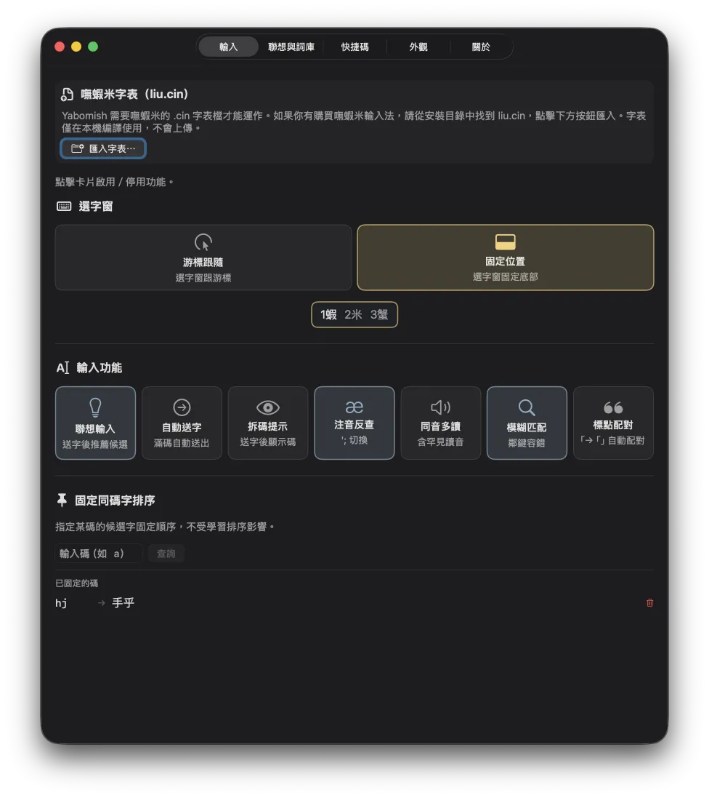
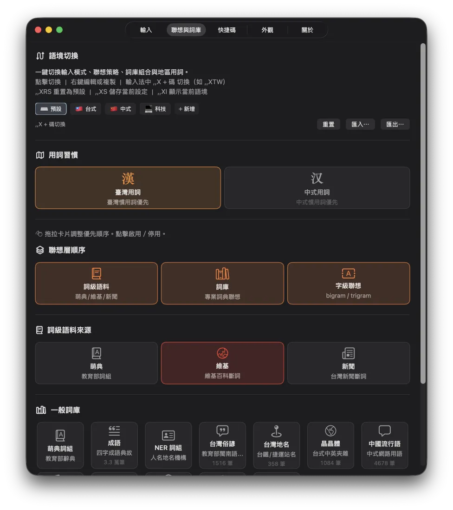
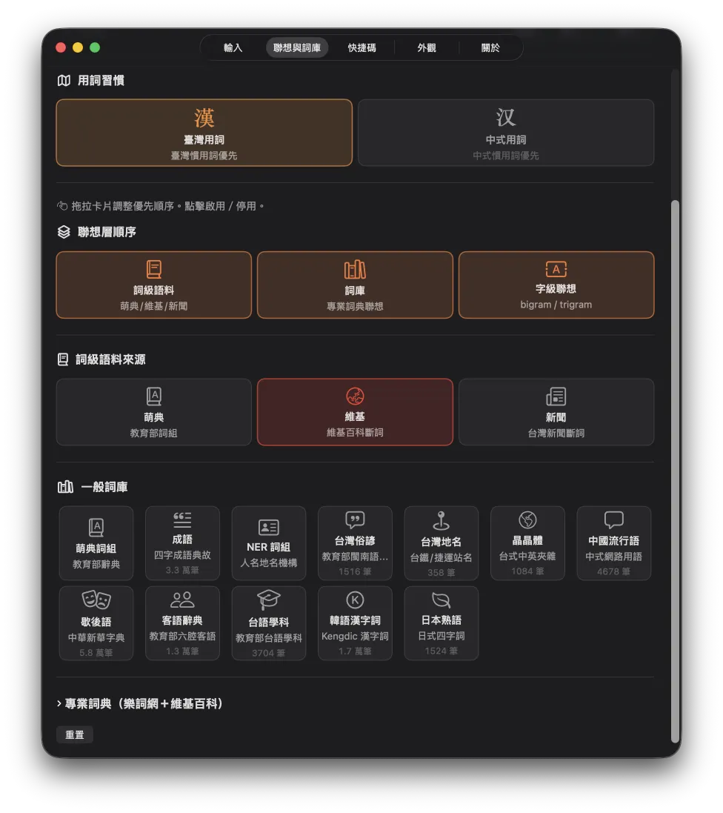
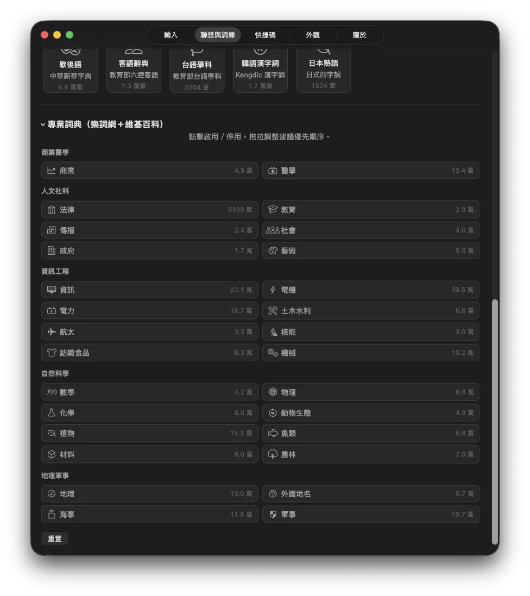

# Yabomish 使用說明

## 安裝

```bash
git clone https://github.com/FakeRocket543/yabomish.git
cd yabomish
bash yabomish.sh
```

選 `1) 完整安裝`。安裝完成後：

1. 系統設定 → 鍵盤 → 輸入方式 → `+` → 搜尋「Yabomish」→ 加入
2. 按 `Ctrl+Space` 切換到 Yabomish
3. 首次使用會引導匯入 `liu.cin`（嘸蝦米字表，需自行取得）

## 基本操作

| 操作 | 按鍵 | 說明 |
|------|------|------|
| 打字 | 字母鍵 | 輸入嘸蝦米碼 |
| 送字 | `Space` | 送出第一候選字 |
| 選字 | `1`–`9` | 選擇候選字 |
| 補碼選字 | `v` `r` `s` `f` | 快速選第 2/3/4/5 候選 |
| 刪碼 | `Backspace` | 刪除最後一碼 |
| 取消 | `Esc` | 清空輸入碼 |
| 送出原始碼 | `Enter` | 直接送出英文字母 |
| 萬用碼 | `*`（Shift+8） | 模糊查詢，如 `a*c` |

## 中英切換

| 操作 | 方式 |
|------|------|
| 切換中/英 | 快按 `Shift`（0.3 秒內放開） |
| 暫時英文 | 按住 `Shift` 不放，打完放開自動回中文 |
| 全型空格 | `Shift+Space` |

## 聯想輸入

送字後自動出現聯想建議，按數字鍵選擇。三層架構：

```
Layer 1: 詞級語料（萌典/維基/新聞斷詞）
Layer 2: 詞庫（成語、歇後語、俗諺、客語、韓語漢字詞⋯⋯）
Layer 3: 字級（bigram/trigram 預測下一字）
```

- 按 `Esc` 關閉聯想
- 虛詞（的、了、嗎⋯⋯）結尾自動停止
- 三層順序可在設定程式中拖拉調整

## 命令系統（`,,`）

輸入 `,,` 進入命令模式，再打命令碼 + `Space`：

| 命令 | 功能 |
|------|------|
| `,,T` | 繁體中文（預設） |
| `,,S` | 簡體中文 |
| `,,J` | 日文假名模式 |
| `,,SP` | 速打模式（僅最短碼） |
| `,,SL` | 慢打模式（僅最長碼） |
| `,,TS` | 繁→簡轉換 |
| `,,ST` | 簡→繁轉換 |
| `,,ZH` | 注音查碼 |
| `,,PYS` | 拼音查碼（簡體） |
| `,,PYT` | 拼音查碼（繁體） |
| `,,TO` | 同音字查詢模式 |
| `,,RS` | 重置字頻統計 |
| `,,RL` | 重載字表＋擴充表 |
| `,,SG` | 聯想開關 |
| `,,C` | 顯示當前模式 |
| `,,H` | 命令說明 |

### 語境切換

| 命令 | 功能 |
|------|------|
| `,,XDF` | ⌨️ 預設（無專業詞庫） |
| `,,XTW` | 🇹🇼 台式（萌典、成語、台灣俗諺、地名、晶晶體） |
| `,,XCH` | 🇨🇳 中式（簡中模式、中國流行語） |
| `,,XTC` | 💻 科技（資訊、電機、數學、晶晶體） |
| `,,XS` | 儲存當前設定到 active 語境 |
| `,,XI` | 顯示當前語境名稱 |
| `,,XRS` | 重置語境（= ,,XDF） |
| `,,X` + 自訂碼 | 切換到使用者自建語境 |

語境切換會一次替換：輸入模式、聯想策略、詞庫組合、地區用詞。
在設定程式「聯想與詞庫」分頁中可管理語境（右鍵編輯、複製、刪除、匯入匯出）。

## 查詢功能

### 同音字
- 打 `,,TO` + `Space` → 進入同音字模式（每次送字列出同音字）
- 再打 `,,TO` + `Space` → 退出

### 注音反查
- 按 `';` 或 `,,ZH` → 輸入注音查嘸蝦米碼

### 拼音查碼
- `,,PYS` 或 `,,PYT` → 輸入拼音 + 聲調數字（1-4，空白鍵 = 一聲）

## 設定程式（YabomishPrefs.app）

從 `/Applications/YabomishPrefs.app` 開啟，或在選字窗右鍵選「設定」。

### 輸入 tab



- **匯入字表** — 匯入嘸蝦米 .cin 字表或 .txt 擴充表
- **選字窗模式** — 游標跟隨 / 固定位置
- **自動送字** — 碼打滿且唯一候選時自動送出
- **模糊匹配** — 鄰鍵容錯
- **標點配對** — 打「自動補」

### 聯想與詞庫 tab



- **語境切換** — 點擊切換預設語境（預設/台式/中式/科技），右鍵可編輯或複製
- **用詞習慣** — 臺灣用詞 / 中式用詞（影響候選字排序）
- **三層順序** — 拖拉調整詞級/詞庫/字級的優先順序
- **詞級語料** — 切換萌典、維基、新聞
- **一般詞庫** — 12 張卡片，可開關、拖拉排序



- **專業詞典** — 5 大類 28 個領域，兩欄 chip 佈局



### 快捷碼 tab
- **空碼綁定** — 用 2–4 碼空碼綁定自訂文字、agent 指令、prompt template
- **匯入匯出** — 支援 tab-separated .txt 格式

### 外觀 tab
- 字體大小、透明度、模式提示大小、蝦頭方向

### 關於 tab
- 使用方法、快捷鍵速查、語料來源與授權

## 擴充表

放在 `~/Library/YabomishIM/tables/` 下，格式為 tab-separated：

```
編碼<Tab>內容
```

例如 `user_shortcuts.txt`（快捷碼綁定）：

```
agpt	請用繁體中文回答，並附上參考來源
asig	— FL, Developer
```

修改後打 `,,RL` + `Space` 即時重載。

## 語料架構

```
Layer 0: CIN 字表（嘸蝦米碼 → 字）
Layer 1: 字頻 + bigram + trigram（使用者學習 + 靜態統計）
Layer 2: 詞級語料（萌典/維基/新聞斷詞）
Layer 3: 詞庫（13 一般 + 20 專業）+ 兩岸標記 + 晶晶體
```

所有語料以 WBMM binary 格式儲存，mmap zero-copy 載入，查詢為 O(log n) binary search。

## 資料路徑

```
~/Library/YabomishIM/
├── liu.cin           # 嘸蝦米字表（使用者匯入）
├── liu.bin           # 編譯後二進位字表
├── freq.db           # 字頻學習資料（SQLite WAL）
├── tables/           # 擴充表
│   └── user_shortcuts.txt  # 使用者快捷碼
├── user_phrases.txt  # 使用者自訂詞組
└── debug.log         # Debug 日誌（開啟時）
```

## 常見問題

**Q: 安裝後在輸入方式列表找不到 Yabomish？**
A: 登出再登入，或重新啟動。macOS 有時需要重新載入輸入法列表。

**Q: 打字沒有候選字？**
A: 確認已匯入 `liu.cin`。設定程式 → 輸入 → 匯入字表。

**Q: 聯想建議太多/太少？**
A: 設定程式 → 聯想與詞庫 → 調整詞庫開關和順序。

**Q: 想用台灣用詞，不想看到中國用詞？**
A: 設定程式 → 聯想與詞庫 → 用詞習慣 → 選「臺灣用詞」。中國用詞會自動降權（不是消失，只是排後面）。也可用語境切換 `,,XTW` 一鍵切到台式模式。

**Q: 記憶體佔用多少？**
A: 約 70MB，大部分是 mmap 虛擬記憶體（OS 按需載入，不佔實體 RAM）。
